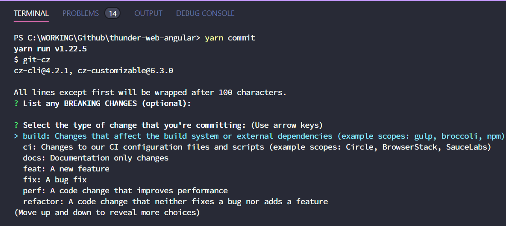

# GIT CONVENTION

## <span style="color:red;">Please, oh please, use `git pull --rebase`</span>

It's much better to use

```
git pull --rebase
```

to keep the repository clean, your commits always on top of the tree until you push them to a remote server. The command will apply all your yet-to-be-pushed commits on top of the remote tree commits allowing your commits to be straight in a row and without branches (easier git bisects, yay!).

Few notes though. If you want to merge a feature branch it might be wiser to actually merge your commits thus having a single point of integration of two distinct branches.

Also the conflict resolving will be now per commit basis, not everything-at-once, so you will have to use

```
git rebase --continue
```

to get to the next batch of conflicts (if you have any).

## Experienced GIT tools

> ### [](https://git-scm.com/)
>
> Git is a free and open source distributed version control system designed to handle everything from small to very large projects with speed and efficiency..

> ### [](http://gitextensions.github.io/)
>
> Git Extensions is a standalone UI tool for managing Git repositories. This is the most lightweight git tool and has the simplest usage.

> ### [](https://www.scootersoftware.com/features.php?zz=features_focused)
>
> Beyond Compare allows you to quickly and easily compare your files and folders. By using simple, powerful commands you can focus on the differences you're interested in and ignore those you're not. You can then merge the changes, synchronize your files, and generate reports for your records.

## <a name="commit"></a> Git Commit Message Guidelines

_We are using the [Commitizen tool](https://www.npmjs.com/package/commitizen) for generating commit messages with [Angular preset](https://www.npmjs.com/package/conventional-changelog-angular)_

### Using the command line tool

> When you commit with `yarn commit` instead of `git commit`, you'll be prompted to fill out any required commit fields at commit time.
>
> 

### Commit message format

Each commit message consists of a **header**, a **body**, and a **footer**.

```
<header>
<BLANK LINE>
<body>
<BLANK LINE>
<footer>
```

The `header` is mandatory and must conform to the [Commit Message Header](#commit-header) format.

The `body` is mandatory for all commits except for those of scope "docs".
When the body is required it must be at least 20 characters long.

The `footer` is optional.

Any line of the commit message cannot be longer than 100 characters.

#### <a href="commit-header"></a>Commit Message Header

```
<type>(<scope>): <short summary>
  │       │             │
  │       │             └─⫸ Summary in present tense. Not capitalized. No period at the end.
  │       │
  │       └─⫸ Commit Scope: repo|misc|release|<app-name>|<lib-name>
  │
  └─⫸ Commit Type: build|ci|docs|feat|fix|perf|refactor|style|test
```

The `<type>` and `<summary>` fields are mandatory, the `(<scope>)` field is optional.

##### Type

Must be one of the following:

- **build**: Changes that affect the build system or external dependencies (example scopes: gulp, broccoli, npm)
- **ci**: Changes to our CI configuration files and scripts (example scopes: Circle, BrowserStack, SauceLabs)
- **docs**: Documentation only changes
- **feat**: A new feature
- **fix**: A bug fix
- **perf**: A code change that improves performance
- **refactor**: A code change that neither fixes a bug nor adds a feature
- **test**: Adding missing tests or correcting existing tests

If the prefix is `feat`, `fix` or `perf`, it will appear in the changelog. However if there is any [BREAKING CHANGE](#footer), the commit will always appear in the changelog.

Other prefixes are up to your discretion. Suggested prefixes are `build`, `ci`, `docs` ,`style`, `refactor`, and `test` for non-changelog related tasks.

##### Scope

The scope should be the name of the npm package affected (as perceived by the person reading the changelog generated from commit messages).

The following is the list of supported scopes:

- `repo`
- `misc`
- `release`

There are currently a few exceptions to the "use library or app name" rule:

- `<app-name>`: used for specific app name.
- `<lib-name>`: used for specific library name.

##### Summary

Use the summary field to provide a succinct description of the change:

- use the imperative, present tense: "change" not "changed" nor "changes"
- don't capitalize the first letter
- no dot (.) at the end

#### Commit Message Body

Just as in the summary, use the imperative, present tense: "fix" not "fixed" nor "fixes".

Explain the motivation for the change in the commit message body. This commit message should explain _why_ you are making the change.
You can include a comparison of the previous behavior with the new behavior in order to illustrate the impact of the change.

#### Commit Message Footer

The footer can contain information about breaking changes and is also the place to reference GitHub issues, Jira tickets, and other PRs that this commit closes or is related to.

```
BREAKING CHANGE: <breaking change summary>
<BLANK LINE>
<breaking change description + migration instructions>
<BLANK LINE>
<BLANK LINE>
Fixes #<issue number>
```

Breaking Change section should start with the phrase "BREAKING CHANGE: " followed by a summary of the breaking change, a blank line, and a detailed description of the breaking change that also includes migration instructions.

### Revert commits

If the commit reverts a previous commit, it should begin with `revert: `, followed by the header of the reverted commit.

The content of the commit message body should contain:

- information about the SHA of the commit being reverted in the following format: `This reverts commit <SHA>`,
- a clear description of the reason for reverting the commit message.
